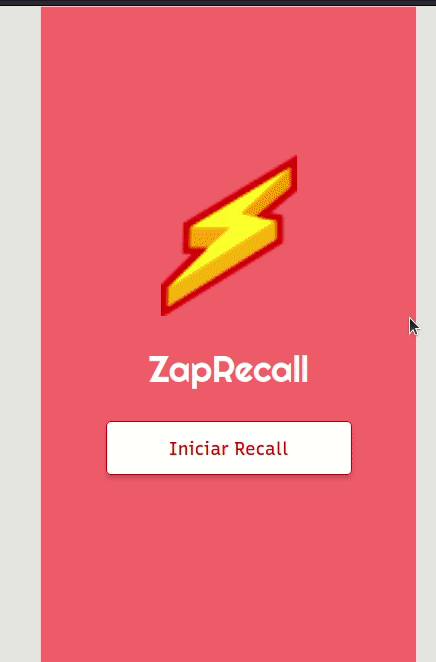

 <br>

# ZapRecall
 <br> <br>
<a href='https://zap-recall-kappa.vercel.app/'><button>  Teste aqui!</button></a>

# Tabela de Conteúdos

* [Sobre](#sobre)
* [Tecnologias](#tecnologias)
* [Pré-Requisitos](#pre-requisitos)

# Sobre
<h3> Nesse projeto usei React para implementar um app de flashcards chamado Zap Recall!</h3>
 <h3>Flashcards são cartões de contém uma pergunta/afirmação na sua frente e uma resposta atrás. É possível utilizá-los para treinar sua memória com as metodologias Active Recall e Spaced Repetition. A ideia é ler a pergunta ou afirmação e tentar lembrar da reposta. Ao se deparar com a mesma, dependendo do esforço necessário para responder ou não o flashcard, você fica consciente de quais conteúdos estão frescos na memória e quais não estão, então, pode praticar com frequência os conteúdos que não estão.</h3>
<h3>  Quando lembramos instantaneamente de um flashcard, tivemos um "Zap!"⚡.</h3> <br>

# Tecnologias


 <br>
                    

# Pré-Requisitos
<h3> Antes de começar você precisará ter instalado na sua máquina um setup de um projeto react, o que inclui:<a href='https://www.devmedia.com.br/como-instalar-o-node-js-npm-e-o-react-no-windows/40329'> npm </a> e create-react-app (caso você queira começar o projeto do zero). Além disso, é bom ter um editor para trabalhar com o código como o <a href='https://code.visualstudio.com/download' > VSCode.</a> </h3>
<h3> <b>Rodando o projeto em sua máquina:</b> </h3>

```bash

 # Clone o repositório do projeto:
 git clone</b> https://github.com/CaioVitor1/ZapRecall.git
 # Acesse a pasta do projeto:
 cd zapRecall
 # Instale as dependencias:
  npm i
 # Execute a aplicação em modo de desenvolvimento: 
 npm start
# O servidor irá rodar na porta 3000. Acesse: http://localhost:3000/ 
```

---

Made with love by <a href='https://www.linkedin.com/in/caiovitor33/'> Caio Vitor </a>

<style>
    button{
        width: 150px;
        height: 41px;
        background: gray;
        border-radius: 10px;
        font-family: 'Roboto';
        font-style: normal;
        font-weight: 700;
        font-size: 18px;
        display: flex;
        align-items: center;
        justify-content: center;
        letter-spacing: 0.018em;
        color: #FFFFFF;
    }
    </style>

    